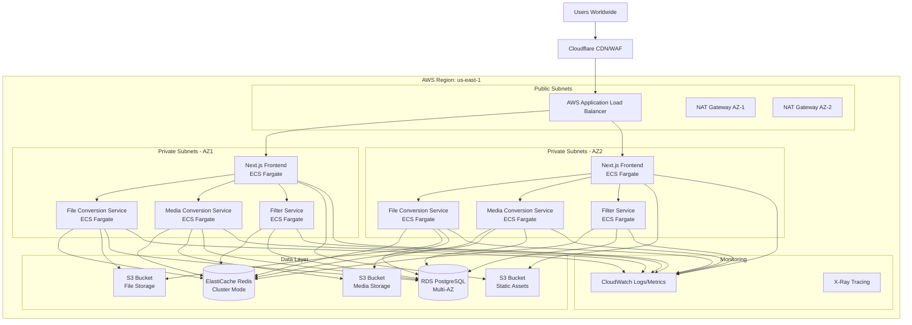
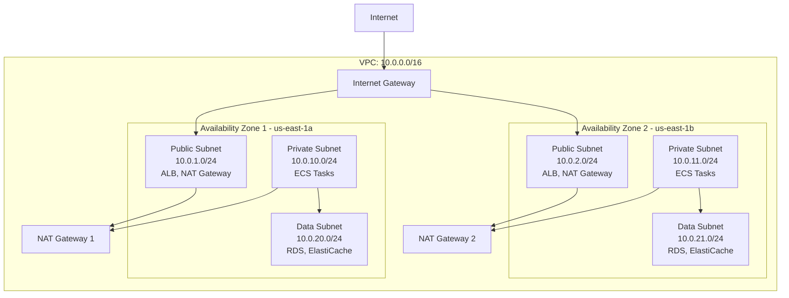
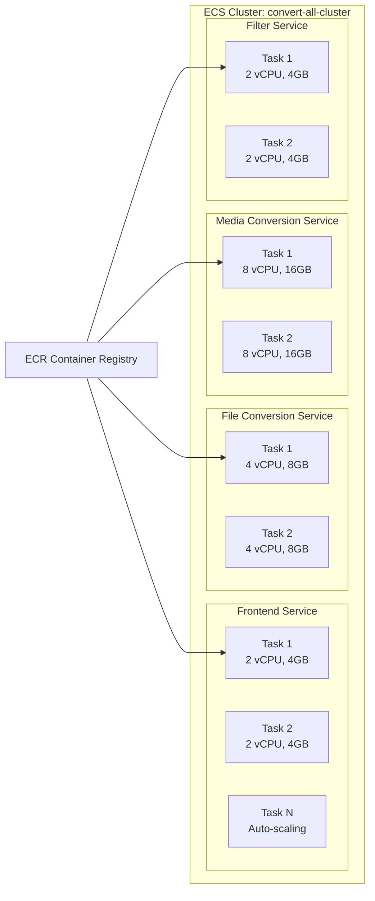
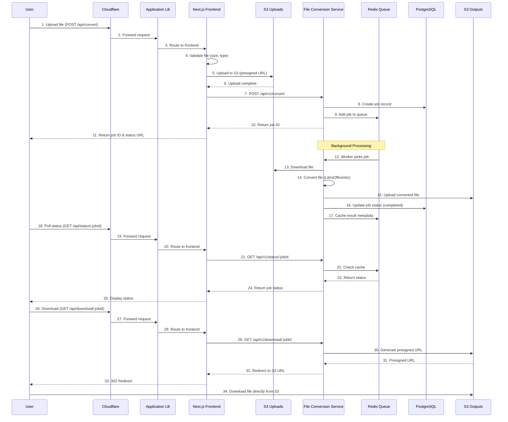
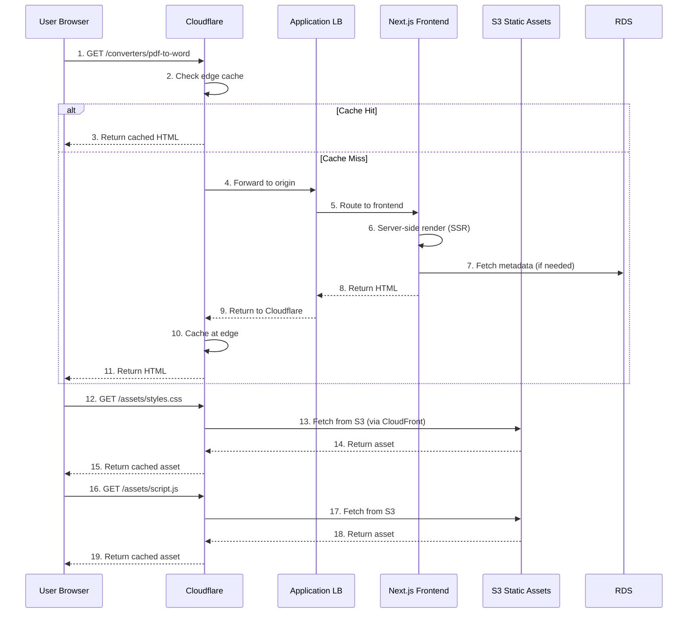
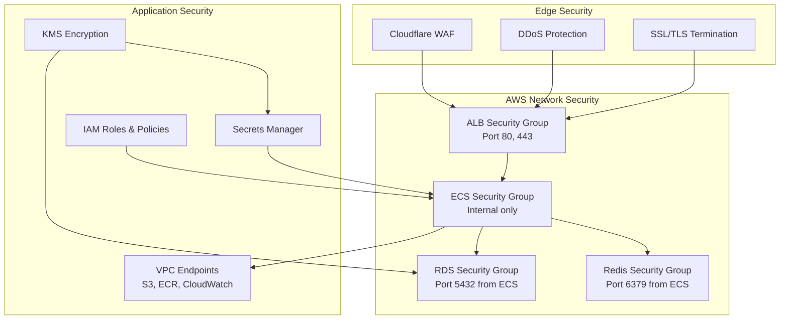
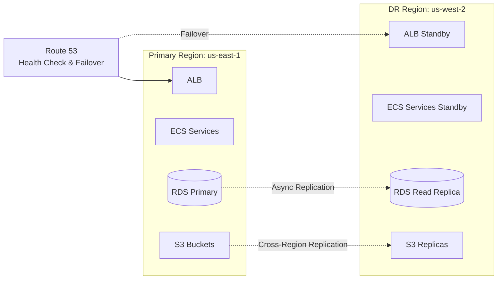
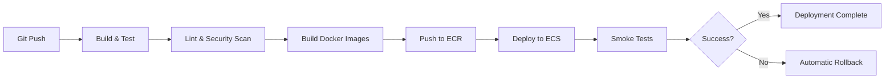

# Convert-All AWS Deployment Plan

## Table of Contents
1. [Architecture Overview](#architecture-overview)
2. [Infrastructure Components](#infrastructure-components)
3. [Network Architecture](#network-architecture)
4. [Request Flow](#request-flow)
5. [Service Deployment](#service-deployment)
6. [Security & Compliance](#security--compliance)
7. [Monitoring & Logging](#monitoring--logging)
8. [Disaster Recovery](#disaster-recovery)
9. [Cost Estimation](#cost-estimation)
10. [Deployment Steps](#deployment-steps)

---

## Architecture Overview

### High-Level Architecture



### Component Summary

| Component | AWS Service | Purpose | High Availability |
|-----------|-------------|---------|-------------------|
| **CDN/WAF** | Cloudflare | Edge caching, DDoS protection, SSL | Global edge network |
| **Load Balancer** | Application Load Balancer | Traffic distribution, health checks | Multi-AZ |
| **Frontend** | ECS Fargate | Next.js SSR application | Multi-AZ, Auto-scaling |
| **Backend Services** | ECS Fargate | 3 microservices (file, media, filter) | Multi-AZ, Auto-scaling |
| **Database** | RDS PostgreSQL | Job metadata, user data | Multi-AZ, automated backups |
| **Cache/Queue** | ElastiCache Redis | Job queues, rate limiting, caching | Cluster mode, Multi-AZ |
| **File Storage** | S3 | Converted files, media, static assets | 99.999999999% durability |
| **Monitoring** | CloudWatch + X-Ray | Logs, metrics, distributed tracing | Built-in HA |

---

## Infrastructure Components

### 1. Networking (VPC)



**VPC Configuration:**
- **CIDR Block:** 10.0.0.0/16
- **Availability Zones:** 2 (us-east-1a, us-east-1b)
- **Subnets:**
  - Public Subnets (2): ALB, NAT Gateways
  - Private Subnets (2): ECS tasks, application layer
  - Data Subnets (2): RDS, ElastiCache (isolated)
- **Internet Gateway:** For public subnet access
- **NAT Gateways:** 2 (one per AZ) for outbound internet from private subnets

### 2. Compute Layer (ECS Fargate)



**ECS Configuration:**

| Service | Task Resources | Scaling Policy | Health Check |
|---------|---------------|----------------|--------------|
| **Frontend** | 2 vCPU, 4GB RAM | 2-10 tasks, CPU > 70% | GET /health |
| **File Conversion** | 4 vCPU, 8GB RAM | 2-8 tasks, Queue depth | GET /health |
| **Media Conversion** | 8 vCPU, 16GB RAM | 2-6 tasks, Queue depth | GET /health |
| **Filter Service** | 2 vCPU, 4GB RAM | 2-10 tasks, CPU > 70% | GET /health |

### 3. Data Layer

**RDS PostgreSQL:**
- **Instance Class:** db.r6g.xlarge (4 vCPU, 32GB RAM)
- **Multi-AZ:** Enabled (automatic failover)
- **Storage:** 500GB GP3, auto-scaling to 1TB
- **Backup:** Automated daily, 7-day retention
- **Schema:**
  - `jobs` table: Job metadata, status, user info
  - `conversions` table: Conversion history
  - `users` table: User accounts (if auth enabled)

**ElastiCache Redis:**
- **Node Type:** cache.r6g.large (2 vCPU, 13.07GB)
- **Cluster Mode:** Enabled (3 shards, 2 replicas per shard)
- **Total Nodes:** 9 (3 primary + 6 replicas)
- **Use Cases:**
  - BullMQ job queues
  - Rate limiting counters
  - Session storage
  - Temporary file metadata cache

**S3 Buckets:**

| Bucket | Purpose | Lifecycle Policy | Access |
|--------|---------|------------------|--------|
| `convert-all-uploads` | User uploaded files | Delete after 24 hours | Private |
| `convert-all-outputs` | Converted files | Delete after 48 hours | Pre-signed URLs |
| `convert-all-static` | Frontend static assets | Never delete | Public via CloudFront |
| `convert-all-logs` | Application logs | Glacier after 90 days | Private |

---

## Request Flow

### User Upload & Conversion Flow



### Frontend Page Load Flow



---

## Service Deployment

### Frontend Deployment (Next.js)

**Dockerfile Optimization:**
```dockerfile
# Already exists at /frontend/Dockerfile (if not, needs creation)
FROM node:20-alpine AS builder
WORKDIR /app
COPY package*.json ./
RUN npm ci --only=production
COPY . .
RUN npm run build

FROM node:20-alpine AS runner
WORKDIR /app
ENV NODE_ENV=production
COPY --from=builder /app/next.config.js ./
COPY --from=builder /app/public ./public
COPY --from=builder /app/.next ./.next
COPY --from=builder /app/node_modules ./node_modules
COPY --from=builder /app/package.json ./package.json

EXPOSE 3000
CMD ["npm", "start"]
```

**ECS Task Definition:**
```json
{
  "family": "convert-all-frontend",
  "networkMode": "awsvpc",
  "requiresCompatibilities": ["FARGATE"],
  "cpu": "2048",
  "memory": "4096",
  "containerDefinitions": [{
    "name": "nextjs",
    "image": "${AWS_ACCOUNT_ID}.dkr.ecr.us-east-1.amazonaws.com/convert-all-frontend:latest",
    "portMappings": [{"containerPort": 3000, "protocol": "tcp"}],
    "environment": [
      {"name": "NODE_ENV", "value": "production"},
      {"name": "NEXT_PUBLIC_API_URL", "value": "https://api.convert-all.com"},
      {"name": "FILE_SERVICE_URL", "value": "http://file-service.local:3000"},
      {"name": "MEDIA_SERVICE_URL", "value": "http://media-service.local:3001"},
      {"name": "FILTER_SERVICE_URL", "value": "http://filter-service.local:3002"}
    ],
    "secrets": [
      {"name": "DATABASE_URL", "valueFrom": "arn:aws:secretsmanager:..."},
      {"name": "REDIS_URL", "valueFrom": "arn:aws:secretsmanager:..."}
    ],
    "logConfiguration": {
      "logDriver": "awslogs",
      "options": {
        "awslogs-group": "/ecs/convert-all-frontend",
        "awslogs-region": "us-east-1",
        "awslogs-stream-prefix": "ecs"
      }
    },
    "healthCheck": {
      "command": ["CMD-SHELL", "curl -f http://localhost:3000/api/health || exit 1"],
      "interval": 30,
      "timeout": 5,
      "retries": 3
    }
  }]
}
```

### Backend Services Deployment

**Docker Compose Override for Production:**
```yaml
# backend/docker-compose.prod.yml
version: '3.8'
services:
  file-conversion:
    image: ${AWS_ACCOUNT_ID}.dkr.ecr.us-east-1.amazonaws.com/convert-all-file-service:${VERSION}
    environment:
      - NODE_ENV=production
      - REDIS_URL=${REDIS_URL}
      - DATABASE_URL=${DATABASE_URL}
      - S3_BUCKET=${S3_UPLOADS_BUCKET}
      - AWS_REGION=us-east-1
    deploy:
      replicas: 2
      resources:
        limits:
          cpus: '4'
          memory: 8G
        reservations:
          cpus: '2'
          memory: 4G

  media-conversion:
    image: ${AWS_ACCOUNT_ID}.dkr.ecr.us-east-1.amazonaws.com/convert-all-media-service:${VERSION}
    environment:
      - NODE_ENV=production
      - REDIS_URL=${REDIS_URL}
      - DATABASE_URL=${DATABASE_URL}
      - S3_BUCKET=${S3_MEDIA_BUCKET}
    deploy:
      replicas: 2
      resources:
        limits:
          cpus: '8'
          memory: 16G
        reservations:
          cpus: '4'
          memory: 8G

  filter-service:
    image: ${AWS_ACCOUNT_ID}.dkr.ecr.us-east-1.amazonaws.com/convert-all-filter-service:${VERSION}
    environment:
      - NODE_ENV=production
      - REDIS_URL=${REDIS_URL}
      - DATABASE_URL=${DATABASE_URL}
      - S3_BUCKET=${S3_OUTPUTS_BUCKET}
    deploy:
      replicas: 2
      resources:
        limits:
          cpus: '2'
          memory: 4G
```

---

## Security & Compliance

### Security Architecture



### Security Groups

**1. ALB Security Group**
```
Inbound:
  - Port 80 (HTTP) from Cloudflare IPs only
  - Port 443 (HTTPS) from Cloudflare IPs only

Outbound:
  - All traffic to ECS Security Group
```

**2. ECS Tasks Security Group**
```
Inbound:
  - Port 3000 from ALB Security Group (Frontend)
  - Port 3000 from Frontend SG (File Service)
  - Port 3001 from Frontend SG (Media Service)
  - Port 3002 from Frontend SG (Filter Service)

Outbound:
  - Port 5432 to RDS Security Group
  - Port 6379 to Redis Security Group
  - Port 443 to VPC Endpoints (S3, ECR, CloudWatch)
```

**3. RDS Security Group**
```
Inbound:
  - Port 5432 from ECS Security Group only

Outbound:
  - None
```

**4. ElastiCache Security Group**
```
Inbound:
  - Port 6379 from ECS Security Group only

Outbound:
  - None
```

### IAM Roles & Policies

**ECS Task Execution Role:**
```json
{
  "Version": "2012-10-17",
  "Statement": [
    {
      "Effect": "Allow",
      "Action": [
        "ecr:GetAuthorizationToken",
        "ecr:BatchCheckLayerAvailability",
        "ecr:GetDownloadUrlForLayer",
        "ecr:BatchGetImage",
        "logs:CreateLogStream",
        "logs:PutLogEvents",
        "secretsmanager:GetSecretValue",
        "kms:Decrypt"
      ],
      "Resource": "*"
    }
  ]
}
```

**ECS Task Role (Application Permissions):**
```json
{
  "Version": "2012-10-17",
  "Statement": [
    {
      "Effect": "Allow",
      "Action": [
        "s3:GetObject",
        "s3:PutObject",
        "s3:DeleteObject"
      ],
      "Resource": [
        "arn:aws:s3:::convert-all-uploads/*",
        "arn:aws:s3:::convert-all-outputs/*"
      ]
    },
    {
      "Effect": "Allow",
      "Action": [
        "s3:ListBucket"
      ],
      "Resource": [
        "arn:aws:s3:::convert-all-uploads",
        "arn:aws:s3:::convert-all-outputs"
      ]
    },
    {
      "Effect": "Allow",
      "Action": [
        "xray:PutTraceSegments",
        "xray:PutTelemetryRecords"
      ],
      "Resource": "*"
    }
  ]
}
```

### Secrets Management

All sensitive data stored in AWS Secrets Manager:
- Database connection strings
- Redis connection strings
- API keys
- JWT secrets
- Third-party service credentials

**Secret Rotation:**
- Database passwords: 30 days
- API keys: 90 days
- Automatic rotation using Lambda functions

---

## Monitoring & Logging

### CloudWatch Dashboards

```mermaid
graph TB
    subgraph "Application Metrics"
        CPU[CPU Utilization]
        Memory[Memory Usage]
        RequestCount[Request Count]
        Latency[Response Latency]
        Errors[Error Rate]
    end

    subgraph "Service Metrics"
        QueueDepth[Queue Depth]
        JobSuccess[Job Success Rate]
        ConversionTime[Conversion Duration]
        StorageUsage[S3 Storage Usage]
    end

    subgraph "Infrastructure Metrics"
        ALBHealth[ALB Target Health]
        RDSConn[RDS Connections]
        RedisHits[Redis Cache Hit Rate]
        ECSTaskCount[ECS Task Count]
    end

    subgraph "Alarms"
        HighCPU[High CPU > 80%]
        HighError[Error Rate > 1%]
        QueueBacklog[Queue Depth > 1000]
        DBConnExhaust[DB Connections > 90%]
    end

    CPU --> HighCPU
    Errors --> HighError
    QueueDepth --> QueueBacklog
    RDSConn --> DBConnExhaust
```



### Logging Strategy

**Log Aggregation:**
```
Application Logs → CloudWatch Logs → S3 (long-term storage)
                              ↓
                    CloudWatch Insights (queries)
                              ↓
                    CloudWatch Alarms (alerts)
```

**Log Groups:**
- `/ecs/convert-all-frontend` - Frontend application logs
- `/ecs/convert-all-file-service` - File conversion service logs
- `/ecs/convert-all-media-service` - Media conversion service logs
- `/ecs/convert-all-filter-service` - Filter service logs
- `/aws/rds/instance/convert-all-db/postgresql` - Database logs
- `/aws/elasticache/convert-all-redis` - Redis logs
- `/aws/lambda/log-processor` - Log processing Lambda

**Log Retention:**
- CloudWatch Logs: 30 days
- S3 Archive: 1 year (then Glacier)
- Error logs: 90 days

### Distributed Tracing (X-Ray)

Enable X-Ray for end-to-end request tracing:
```javascript
// Add to all services
const AWSXRay = require('aws-xray-sdk-core');
const AWS = AWSXRay.captureAWS(require('aws-sdk'));
const http = AWSXRay.captureHTTPs(require('http'));
```

**Trace Components:**
- Frontend → Backend API calls
- Backend → S3 operations
- Backend → RDS queries
- Backend → Redis operations
- Backend → External API calls

---

## Disaster Recovery

### Backup Strategy

**RDS Automated Backups:**
- Daily automated snapshots
- 7-day retention period
- Point-in-time recovery (5-minute RPO)
- Cross-region backup replication to us-west-2

**S3 Versioning & Replication:**
- Versioning enabled on all buckets
- Cross-region replication to us-west-2
- Lifecycle policies for cost optimization

**ElastiCache Backups:**
- Daily automated backups
- 7-day retention
- Manual snapshots before major changes

### High Availability

**RTO/RPO Targets:**
| Component | RTO (Recovery Time) | RPO (Data Loss) |
|-----------|---------------------|-----------------|
| Frontend | < 5 minutes | 0 (stateless) |
| Backend Services | < 5 minutes | 0 (stateless) |
| Database | < 15 minutes | < 5 minutes |
| Redis Cache | < 10 minutes | < 5 minutes |

**Failover Procedures:**

1. **Frontend/Backend Failover:**
   - Automatic via ECS service auto-scaling
   - Health checks every 30 seconds
   - Unhealthy tasks replaced automatically

2. **Database Failover:**
   - RDS Multi-AZ automatic failover
   - Failover time: 60-120 seconds
   - No data loss (synchronous replication)

3. **Redis Failover:**
   - ElastiCache cluster mode automatic failover
   - Failover time: < 60 seconds
   - Replica promotion

### Multi-Region DR Plan

**Primary Region:** us-east-1 (N. Virginia)
**DR Region:** us-west-2 (Oregon)



**DR Activation Steps:**
1. Detect primary region failure (Route 53 health checks)
2. Promote DR RDS read replica to primary
3. Update Route 53 DNS to point to DR region
4. Scale up ECS services in DR region
5. Verify service functionality
6. Notify stakeholders

---

## Cost Estimation

### Monthly Cost Breakdown (Estimated)

| Component | Configuration | Monthly Cost |
|-----------|--------------|--------------|
| **Compute (ECS Fargate)** | | |
| Frontend (2-10 tasks) | 2 vCPU, 4GB | $150 - $750 |
| File Service (2-8 tasks) | 4 vCPU, 8GB | $300 - $1,200 |
| Media Service (2-6 tasks) | 8 vCPU, 16GB | $600 - $1,800 |
| Filter Service (2-10 tasks) | 2 vCPU, 4GB | $150 - $750 |
| **Database** | | |
| RDS PostgreSQL | db.r6g.xlarge, Multi-AZ | $520 |
| RDS Storage | 500GB GP3 | $115 |
| **Caching** | | |
| ElastiCache Redis | 9 nodes (r6g.large) | $1,350 |
| **Storage** | | |
| S3 Storage | 1TB uploads/outputs | $23 |
| S3 Requests | 10M PUT, 100M GET | $55 |
| **Networking** | | |
| Application Load Balancer | 2 AZs | $20 |
| Data Transfer Out | 1TB/month | $90 |
| NAT Gateway | 2 gateways | $90 |
| **Monitoring** | | |
| CloudWatch Logs | 50GB/month | $25 |
| CloudWatch Metrics | Custom metrics | $30 |
| X-Ray | 1M traces/month | $5 |
| **Cloudflare** | | |
| Pro Plan | Custom domain, WAF | $20 |
| **TOTAL (Baseline)** | | **~$3,543/month** |
| **TOTAL (Peak Load)** | | **~$6,700/month** |

**Cost Optimization Strategies:**
1. Use Reserved Instances for RDS (save 40%)
2. Implement aggressive S3 lifecycle policies
3. Use S3 Intelligent-Tiering for long-term storage
4. Right-size ECS tasks based on metrics
5. Enable ECS Fargate Spot for non-critical workloads (70% savings)
6. Use CloudFront for static assets (reduce S3 GET costs)

---

## Deployment Steps

### Prerequisites

1. **AWS Account Setup**
   - Root account with billing enabled
   - IAM user with AdministratorAccess
   - AWS CLI configured
   - Terraform or AWS CDK installed

2. **Domain & DNS**
   - Domain registered (e.g., convert-all.com)
   - Cloudflare account with domain added
   - SSL certificate requested in ACM (us-east-1)

3. **Repository & CI/CD**
   - GitHub repository
   - GitHub Actions or AWS CodePipeline configured
   - ECR repositories created

### Phase 1: Infrastructure Setup (Terraform)

**Step 1: Create VPC & Networking**
```bash
cd terraform/networking
terraform init
terraform plan
terraform apply
```

**Step 2: Create Data Layer**
```bash
cd terraform/data
terraform init
terraform plan -var-file=prod.tfvars
terraform apply -var-file=prod.tfvars
```

**Step 3: Create ECS Cluster & Services**
```bash
cd terraform/compute
terraform init
terraform plan -var-file=prod.tfvars
terraform apply -var-file=prod.tfvars
```

### Phase 2: Application Deployment

**Step 1: Build & Push Docker Images**
```bash
# Authenticate to ECR
aws ecr get-login-password --region us-east-1 | \
  docker login --username AWS --password-stdin ${AWS_ACCOUNT_ID}.dkr.ecr.us-east-1.amazonaws.com

# Build and push frontend
cd frontend
docker build -t convert-all-frontend:latest .
docker tag convert-all-frontend:latest \
  ${AWS_ACCOUNT_ID}.dkr.ecr.us-east-1.amazonaws.com/convert-all-frontend:latest
docker push ${AWS_ACCOUNT_ID}.dkr.ecr.us-east-1.amazonaws.com/convert-all-frontend:latest

# Build and push backend services
cd backend/file-conversion-service
docker build -t convert-all-file-service:latest .
docker tag convert-all-file-service:latest \
  ${AWS_ACCOUNT_ID}.dkr.ecr.us-east-1.amazonaws.com/convert-all-file-service:latest
docker push ${AWS_ACCOUNT_ID}.dkr.ecr.us-east-1.amazonaws.com/convert-all-file-service:latest

# Repeat for media and filter services
```

**Step 2: Deploy Services to ECS**
```bash
# Update ECS services with new task definitions
aws ecs update-service \
  --cluster convert-all-cluster \
  --service convert-all-frontend \
  --force-new-deployment

# Monitor deployment
aws ecs wait services-stable \
  --cluster convert-all-cluster \
  --services convert-all-frontend
```

### Phase 3: DNS & CDN Configuration

**Step 1: Configure Cloudflare**
```bash
# Add DNS records
A    convert-all.com        → ALB_IP_ADDRESS (proxied)
A    www.convert-all.com    → ALB_IP_ADDRESS (proxied)
A    api.convert-all.com    → ALB_IP_ADDRESS (proxied)

# Configure Page Rules
Rule 1: convert-all.com/*
  - Cache Level: Standard
  - Browser Cache TTL: 4 hours
  - Edge Cache TTL: 2 hours

Rule 2: convert-all.com/api/*
  - Cache Level: Bypass

# Configure WAF Rules
- Enable OWASP Core Ruleset
- Rate limiting: 100 req/min per IP
- Challenge on suspicious traffic
```

**Step 2: Verify SSL/TLS**
```bash
# Test HTTPS
curl -I https://convert-all.com
# Should return 200 OK with SSL cert

# Test HTTP → HTTPS redirect
curl -I http://convert-all.com
# Should return 301 redirect to HTTPS
```

### Phase 4: Monitoring & Alerting

**Step 1: Create CloudWatch Dashboards**
```bash
aws cloudwatch put-dashboard \
  --dashboard-name convert-all-production \
  --dashboard-body file://cloudwatch-dashboard.json
```

**Step 2: Configure Alarms**
```bash
# High CPU alarm
aws cloudwatch put-metric-alarm \
  --alarm-name convert-all-high-cpu \
  --alarm-description "Alert on high CPU usage" \
  --metric-name CPUUtilization \
  --namespace AWS/ECS \
  --statistic Average \
  --period 300 \
  --threshold 80 \
  --comparison-operator GreaterThanThreshold \
  --evaluation-periods 2 \
  --alarm-actions arn:aws:sns:us-east-1:${ACCOUNT_ID}:ops-alerts

# High error rate alarm
aws cloudwatch put-metric-alarm \
  --alarm-name convert-all-high-errors \
  --metric-name HTTPCode_Target_5XX_Count \
  --namespace AWS/ApplicationELB \
  --statistic Sum \
  --period 60 \
  --threshold 10 \
  --comparison-operator GreaterThanThreshold \
  --evaluation-periods 2 \
  --alarm-actions arn:aws:sns:us-east-1:${ACCOUNT_ID}:ops-alerts
```

### Phase 5: Testing & Validation

**Step 1: Smoke Tests**
```bash
# Test frontend
curl https://convert-all.com/health
# Expected: {"status":"ok"}

# Test backend services
curl https://api.convert-all.com/api/v1/health
# Expected: {"status":"healthy","services":["file","media","filter"]}
```

**Step 2: Load Testing**
```bash
# Install k6 or artillery
npm install -g artillery

# Run load test
artillery quick --count 100 --num 10 https://convert-all.com
```

**Step 3: End-to-End Test**
```bash
# Upload test file
curl -X POST https://convert-all.com/api/convert \
  -F "file=@test.docx" \
  -F "targetFormat=pdf" \
  | jq -r '.jobId'

# Check status
curl https://convert-all.com/api/status/${JOB_ID}

# Download result
curl -L https://convert-all.com/api/download/${JOB_ID} \
  -o result.pdf
```

---

## CI/CD Pipeline

### GitHub Actions Workflow



**Workflow File:** `.github/workflows/deploy-production.yml`
```yaml
name: Deploy to Production

on:
  push:
    branches: [main]

jobs:
  deploy:
    runs-on: ubuntu-latest
    steps:
      - uses: actions/checkout@v3

      - name: Configure AWS credentials
        uses: aws-actions/configure-aws-credentials@v2
        with:
          aws-access-key-id: ${{ secrets.AWS_ACCESS_KEY_ID }}
          aws-secret-access-key: ${{ secrets.AWS_SECRET_ACCESS_KEY }}
          aws-region: us-east-1

      - name: Login to Amazon ECR
        id: login-ecr
        uses: aws-actions/amazon-ecr-login@v1

      - name: Build, tag, and push frontend image
        env:
          ECR_REGISTRY: ${{ steps.login-ecr.outputs.registry }}
          IMAGE_TAG: ${{ github.sha }}
        run: |
          docker build -t $ECR_REGISTRY/convert-all-frontend:$IMAGE_TAG ./frontend
          docker push $ECR_REGISTRY/convert-all-frontend:$IMAGE_TAG

      - name: Deploy to ECS
        run: |
          aws ecs update-service \
            --cluster convert-all-cluster \
            --service convert-all-frontend \
            --force-new-deployment

      - name: Wait for service stability
        run: |
          aws ecs wait services-stable \
            --cluster convert-all-cluster \
            --services convert-all-frontend
```

---

## Troubleshooting Guide

### Common Issues

**Issue 1: ECS Tasks Failing to Start**
```bash
# Check task logs
aws logs tail /ecs/convert-all-frontend --follow

# Check task status
aws ecs describe-tasks \
  --cluster convert-all-cluster \
  --tasks ${TASK_ARN}

# Common causes:
# - Missing secrets in Secrets Manager
# - Incorrect IAM permissions
# - Container health check failures
```

**Issue 2: High Latency**
```bash
# Check ALB metrics
aws cloudwatch get-metric-statistics \
  --namespace AWS/ApplicationELB \
  --metric-name TargetResponseTime \
  --dimensions Name=LoadBalancer,Value=app/convert-all-lb/... \
  --start-time 2024-01-01T00:00:00Z \
  --end-time 2024-01-01T23:59:59Z \
  --period 3600 \
  --statistics Average

# Check database performance
# - RDS Performance Insights
# - Slow query logs
# - Connection pool exhaustion
```

**Issue 3: Queue Backlog**
```bash
# Check Redis queue depth
redis-cli -h ${REDIS_ENDPOINT} LLEN bull:file-conversion:wait

# Scale up workers
aws ecs update-service \
  --cluster convert-all-cluster \
  --service convert-all-file-service \
  --desired-count 6
```

---

## Maintenance & Operations

### Regular Maintenance Tasks

**Daily:**
- Monitor CloudWatch dashboards
- Review error logs
- Check queue depths

**Weekly:**
- Review cost reports
- Analyze performance metrics
- Update security patches

**Monthly:**
- Review and optimize auto-scaling policies
- Clean up old S3 files
- Review and rotate secrets
- Capacity planning review

### Scaling Guidelines

**Horizontal Scaling (Add More Tasks):**
```bash
# Increase task count
aws ecs update-service \
  --cluster convert-all-cluster \
  --service convert-all-file-service \
  --desired-count 8
```

**Vertical Scaling (Larger Tasks):**
```bash
# Update task definition with more resources
# Then update service
aws ecs update-service \
  --cluster convert-all-cluster \
  --service convert-all-media-service \
  --task-definition convert-all-media-service:v2
```

---

## Appendix

### A. Cloudflare IP Ranges

Whitelist these IP ranges in ALB security group:
```
173.245.48.0/20
103.21.244.0/22
103.22.200.0/22
103.31.4.0/22
141.101.64.0/18
108.162.192.0/18
190.93.240.0/20
188.114.96.0/20
197.234.240.0/22
198.41.128.0/17
162.158.0.0/15
104.16.0.0/13
104.24.0.0/14
172.64.0.0/13
131.0.72.0/22
```

### B. Required AWS Services

Enable these AWS services in your account:
- VPC
- ECS (Fargate)
- ECR
- RDS
- ElastiCache
- S3
- CloudWatch
- X-Ray
- Secrets Manager
- KMS
- IAM
- ACM (Certificate Manager)

### C. Estimated Deployment Timeline

| Phase | Duration | Dependencies |
|-------|----------|--------------|
| Infrastructure Setup | 2-3 days | AWS account, Terraform |
| Application Deployment | 1-2 days | Docker images, ECR |
| DNS & CDN Configuration | 4-6 hours | Domain, Cloudflare |
| Monitoring & Alerting | 1 day | CloudWatch, SNS |
| Testing & Validation | 1-2 days | Test data, scripts |
| **Total** | **5-8 days** | |

---

**Document Version:** 1.0
**Last Updated:** 2024-01-05
**Author:** DevOps Team
**Review Date:** 2024-02-05
