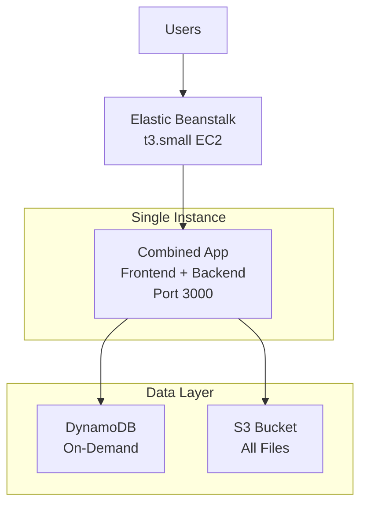

# Convert-All AWS Deployment Plan - Minimal Cost Version

## Table of Contents
1. [Architecture Overview](#architecture-overview)
2. [Infrastructure Components](#infrastructure-components)
3. [Cost Estimation](#cost-estimation)
4. [Deployment Steps](#deployment-steps)

---

## Architecture Overview - Minimal Cost

### Simplified Architecture - Elastic Beanstalk



### Component Summary - Ultra Cost Optimized

| Component | AWS Service | Purpose | Cost Optimization |
|-----------|-------------|---------|-------------------|
| **Compute** | Elastic Beanstalk | Combined app on single EC2 | t3.small, auto-scaling |
| **Load Balancer** | Built-in ALB | Traffic distribution | Included with EB |
| **Database** | DynamoDB | Job metadata, queues | On-demand pricing |
| **File Storage** | S3 | All files in one bucket | Lifecycle policies |

---

## Infrastructure Components - Minimal

### 1. Networking (VPC)

**Simplified VPC Configuration:**
- **CIDR Block:** 10.0.0.0/16
- **Single Availability Zone:** us-east-1a only
- **Subnets:**
  - Public Subnet: 10.0.1.0/24 (ALB)
  - Private Subnet: 10.0.10.0/24 (ECS tasks)
- **Internet Gateway:** For public subnet access
- **No NAT Gateway:** ECS tasks use public IPs (cost savings)

### 2. Compute Layer (Elastic Beanstalk)

**Single Instance Configuration:**

| Component | Instance Type | Purpose |
|-----------|---------------|---------|
| **Combined App** | t3.small (2 vCPU, 2GB) | Frontend + Backend on single server |
| **Auto Scaling** | 1-3 instances | Scale based on CPU/memory |
| **Load Balancer** | Application LB | Built-in with Elastic Beanstalk |

### 3. Data Layer

**DynamoDB (On-Demand):**
- **Billing Mode:** On-demand (pay per request)
- **Tables:**
  - `jobs` - Job metadata and status
  - `queue` - Simple job queue
  - `rate_limits` - Rate limiting counters
- **Use Cases:**
  - Job tracking and metadata
  - Simple job queuing
  - Rate limiting
  - Session storage

**S3 Bucket (Single):**
- **Purpose:** All files (uploads, outputs, static)
- **Lifecycle Policy:** Delete after 7 days
- **Access:** Pre-signed URLs only

---

## Cost Estimation - Ultra Minimal

### Monthly Cost Breakdown

| Component | Configuration | Monthly Cost |
|-----------|--------------|--------------| 
| **Elastic Beanstalk** | t3.small EC2 instance | ~$15 |
| **Load Balancer** | Included with EB | ~$18 |
| **DynamoDB** | On-demand, low usage | ~$5 |
| **S3** | 100GB storage, lifecycle | ~$3 |
| **Data Transfer** | 100GB/month | ~$9 |
| **CloudWatch** | Basic logs | ~$5 |
| **TOTAL** | | **~$55/month** |

### Cost Optimization Benefits
- **No RDS:** Saves ~$520/month
- **No Redis:** Saves ~$15/month  
- **Single AZ:** Saves ~$45/month (NAT Gateway)
- **Minimal resources:** Saves ~$2,000/month vs full setup
- **DynamoDB on-demand:** Only pay for actual usage

---

## Deployment Steps - Minimal

### 1. Create DynamoDB Tables
```bash
# Jobs table
aws dynamodb create-table \
  --table-name convert-all-jobs \
  --attribute-definitions AttributeName=id,AttributeType=S \
  --key-schema AttributeName=id,KeyType=HASH \
  --billing-mode PAY_PER_REQUEST

# Queue table  
aws dynamodb create-table \
  --table-name convert-all-queue \
  --attribute-definitions AttributeName=id,AttributeType=S \
  --key-schema AttributeName=id,KeyType=HASH \
  --billing-mode PAY_PER_REQUEST
```

### 2. Create S3 Bucket
```bash
aws s3 mb s3://convert-all-files-$(date +%s)
aws s3api put-bucket-lifecycle-configuration \
  --bucket convert-all-files-$(date +%s) \
  --lifecycle-configuration file://lifecycle.json
```

### 3. Create Multi-Container Setup
```json
// Dockerrun.aws.json
{
  "AWSEBDockerrunVersion": 2,
  "containerDefinitions": [
    {
      "name": "frontend",
      "image": "your-account.dkr.ecr.us-east-1.amazonaws.com/convert-all-frontend:latest",
      "memory": 512,
      "portMappings": [{
        "hostPort": 80,
        "containerPort": 3000
      }]
    },
    {
      "name": "backend", 
      "image": "your-account.dkr.ecr.us-east-1.amazonaws.com/convert-all-backend:latest",
      "memory": 1024,
      "portMappings": [{
        "hostPort": 3001,
        "containerPort": 3000
      }]
    }
  ]
}
```

### 4. Deploy to Elastic Beanstalk (Docker)
```bash
# Use existing Docker images
eb init convert-all --platform docker
eb create production --instance-type t3.small
eb deploy
```

**Total Setup Time:** 1 hour
**Monthly Cost:** ~$55